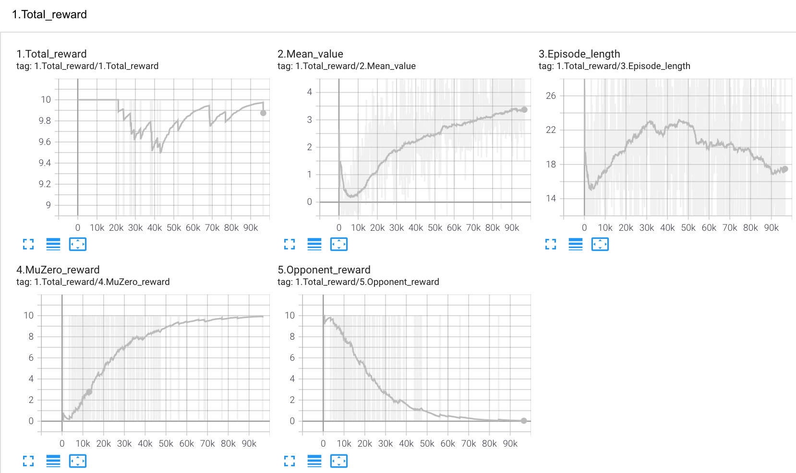
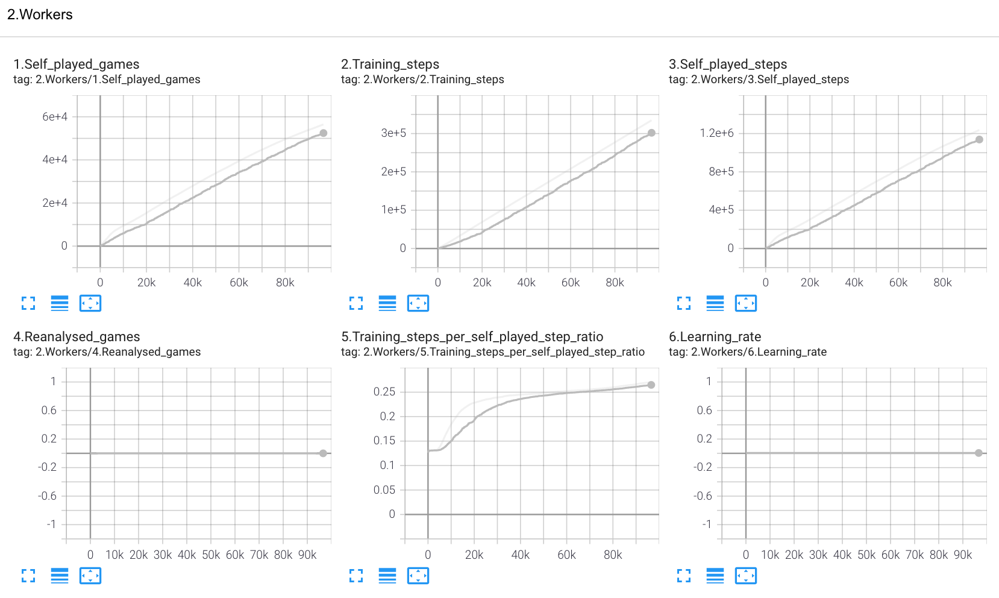
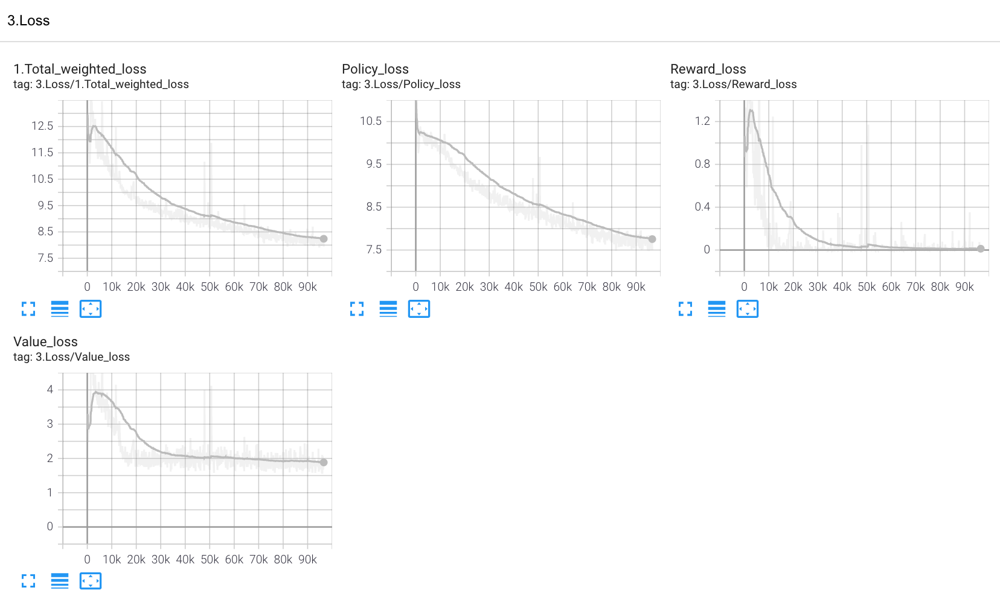

# Game: Connect4

- Date: 2021-01-18
- Environment:
  - GPU: GeForce GTX 1080 (8GB Memory)
  - CPU: 8 CPU (Intel(R) Core(TM) i7-7700K CPU @ 4.20GHz)
  - Memory: 64GB
  - OS: CentOS 7.5
- SourceCode Version: [connect4-0118](https://github.com/mokemokechicken/muzero-general/tree/connect4-0118)
- Trained Model: download [model.checkpoint](./model.checkpoint)

## TensorBoard

## Parameters

| Parameter | Value |
|-----|-----|
| seed | 0 |
| max_num_gpus | None |
| observation_shape | (3, 6, 7) |
| action_space | [0, 1, 2, 3, 4, 5, 6] |
| players | [0, 1] |
| stacked_observations | 0 |
| muzero_player | 0 |
| opponent | expert |
| num_workers | 5 |
| selfplay_on_gpu | False |
| max_moves | 42 |
| num_simulations | 50 |
| discount | 1 |
| temperature_threshold | None |
| root_dirichlet_alpha | 0.2 |
| root_exploration_fraction | 0.25 |
| pb_c_base | 19652 |
| pb_c_init | 1.25 |
| network | resnet |
| support_size | 1 |
| downsample | False |
| blocks | 3 |
| channels | 64 |
| reduced_channels_reward | 8 |
| reduced_channels_value | 8 |
| reduced_channels_policy | 8 |
| resnet_fc_reward_layers | [16] |
| resnet_fc_value_layers | [16] |
| resnet_fc_policy_layers | [16] |
| encoding_size | 32 |
| fc_representation_layers | [] |
| fc_dynamics_layers | [64] |
| fc_reward_layers | [64] |
| fc_value_layers | [] |
| fc_policy_layers | [] |
| results_path | /home/ken/muzero-general/games/../results/connect4/2021-01-18--07-07-21 |
| save_model | True |
| training_steps | 1000000 |
| batch_size | 256 |
| checkpoint_interval | 10 |
| value_loss_weight | 0.25 |
| train_on_gpu | True |
| optimizer | Adam |
| weight_decay | 1e-05 |
| momentum | 0.9 |
| lr_init | 0.005 |
| lr_decay_rate | 1 |
| lr_decay_steps | 10000 |
| replay_buffer_size | 10000 |
| num_unroll_steps | 5 |
| td_steps | 42 |
| PER | False |
| PER_alpha | 0.5 |
| use_last_model_value | False |
| reanalyse_on_gpu | False |
| self_play_delay | 0 |
| training_delay | 0 |
| ratio | None |
